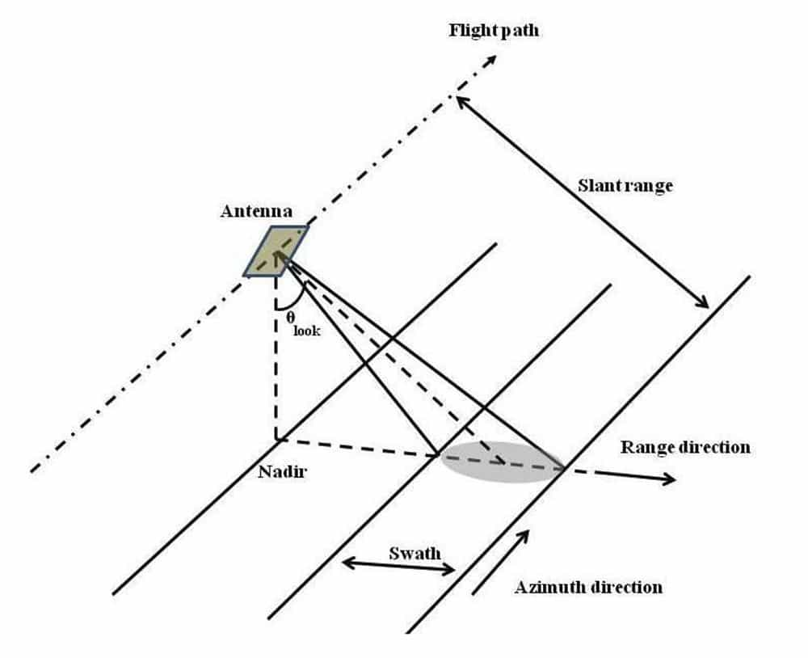
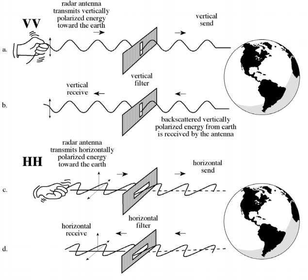

  ## GIS 712-Environmental Earth Observation and Remote Sensing
  --- 
  ### Water mapping time-series using Sentinel-1 in Google Earth Engine (GEE)
  

  <figure>
   <center>
  
  <figcaption>Sentinel 1 mission overview. Credit: ESA</figcaption>
  </center>
  </figure>
  
---
### Objectives:
---

- Explore Sentinel-1 imagery in GEE
- Use Otsu Thresholding to separate water and land pixels in GEE.
- Calculate inundation area for Lake Raleigh, plot, and export the results

To sign up for GEE please go to their [website](https://earthengine.google.com/). However, by now you should all have signed up to GEE. Please use [this link](https://code.earthengine.google.com/) to start and/or read about the sign-up process [here](https://developers.google.com/earth-engine/guides/access#individual-signup).

Why GEE ? Check [here](https://www.youtube.com/watch?v=gKGOeTFHnKY&ab_channel=GoogleEarthGoogleEarthVerified).  

For a quick tutorial on how to use GEE please check this [web page](https://www.geospatialecology.com/intro_rs_lab1/) put together by Dr. Shaun R Levick.

---
### Background information:
---
#### *What is Synthetic Aperture Radar (SAR)*?  
  
  - SAR is an active remote sensing sensor that first transmits microwave signals and then receives back the signals that are returned from the Earth's surface. The microwaves that are received back are called **backscatter**.

#### *What are common SAR satellites*?  

  - Sentinel 1, Envisat, JERS, ALOS, ALOS-2, NISAR, TerraSAR-X, TanDEM-X, etc.

#### *How does SAR work*?  

  - SAR satellites enable imagery to be obtained during both day and night-time. SAR sensors are active remote sensing (i.e., SAR sensors carry their own illumination source). In addition, SAR microwave wavelengths can penetrate through clouds, allowing usage under all weather conditions.
  - The instruments onboard of the satellites measure the distance between the sensor and the point on Earth's surface where the signal is backscattered. This distance is called **slant range** (see illustration), and it can be projected on the ground, representing the **ground range** distance. The flight direction is also reffered to as **along-track** or **azimuth** direction, and the direction perpendicular to the flight path is the **across-track** or **range direction**. The angle between the direction the antenna is pointing and the nadir is the **look angle**. The angle between the radar beam center and the normal to the local topography is the **incidence angle**.
  
  <figure>
   <center>
  
  <figcaption>A typical side-looking radar pointing perpendicular to the flight direction. Credit: NASA</figcaption>
  </center>
  </figure>

  - The **look angle** significantly affects the behavior of the backscatter signal, and it has key influence on the incidence angle of the backscattered signal. Depending on the Earth's characteristics of the illuminated terrain, areas of **layover** and **shadow** may occur.

#### *What are the most common RADAR bands*?  

  <figure>
   <center>
  
  <figcaption>The electromagnetic spectrum with microwave bands inset. Credit: NASA</figcaption>
  </center>
  </figure>

  - RADAR bands represent a selection of wavelenghts. The most common SAR bands area X-band, C-band, and L-band, each of these bands has its own penetration characteristics which are affected by different materials and conditions on Earth's surface.
  - X band: frequency range from 8–12 GHz (2.4-3.8 cm cm wavelength). High resolution SAR (urban monitoring, ice and snow, little penetration into vegetation cover; fast coherence decay in vegetated areas).
  - C band: frequency range from 4–8 GHz (3.8-7.5 cm). Most widely used band for global mapping; change detection; monitoring of areas with low to moderate penetration; higher coherence); ice, ocean maritime navigation.
  - L band: frequency range from 1–2 GHz (15-30 cm). Medium resolution SAR, used for geophysical monitoring; biomass and vegetation mapping; high penetration, InSAR. 

#### *What are SAR polarization and scattering mechanisms*?

  - Polarization refers to the orientation of the plane in which the transmitted electromagnetic wave oscillates. The horizontal polarization is indicated by the letter H, and the vertical polarization is indicated by V.
  - The advantage of radar sensors is that signal polarization can be precisely controlled on both transmit and receive. 
  - Signals emitted in vertical (V) and received in horizontal (H) polarization would be indicated by a VH. Alternatively, a signal that was emitted in horizontal (H) and received in horizontal (H) would be indicated by HH.
  - The signal strength from these different polarizations carries information about the structure of the imaged surface, based on the following types of scattering: surface roughness, volume, and double bounce.
  
    <figure>
   <center>
  
  <figcaption>Different SAR polarization channels. Source: J. R. Jensen. 2000. Remote Sensing of the Environment.  </figcaption>
  </center>
  </figure>


#### *What is Interferometry (InSAR)*?

  - InSAR uses the phase information recorded by the sensor to measure the distance from the sensor to the target. When at least two observations of the same target are made, the distance, with additional geometric information from the sensor, can be used to measure changes in land surface topography.

For general SAR information, please check the following resources:
  - NASA's Alaska Satellite Facility [website](https://asf.alaska.edu/information/sar-information/what-is-sar/).
  - NASA Earth Open Data about SAR [website](https://earthdata.nasa.gov/learn/backgrounders/what-is-sar).
  - NASA SAR [Handbook](https://ntrs.nasa.gov/api/citations/20190002511/downloads/20190002511.pdf?attachment=true). 

---
 ### General guidelines:
---
For this exercise we will only need a shapefile of Lake Raleigh, which can be found in the */data* subfolder. You can follow this [tutorial](https://developers.google.com/earth-engine/guides/importing) on how to add a shapefile to GEE.

The script for this exercise plots a timeseries of surface water area for Lake Raleigh, and enables the users to hover over the graph to see the area mapped as water at a specific date. Water classification is derived from Sentinel-1 Synthetic Aperture Radar (SAR) using VV polarization and ascending pass.

The script for this exercise is [here](https://code.earthengine.google.com/1c1613e1436edf74d6401c9025590675).


Before running the script, you will need to do the following steps:

1) Load the Lake Raleigh shapefile to Google Earth Engine.
2) Change path of the shapefile based on your library name (e.g., "users/YOUR_PATH/LakeRaleigh" )
3) Now, you can run the entire script, or you can simply copy and paste the code snippets below into a new file in GEE, which will allow you to break down the code.

As a first step, we are going to buffer the shapefile of Lake Raleigh by 20 m and 100 meters. Then, we use the 100 meters buffer to clip the image collection before the water classification—this ensures that we have non-water and water pixels for evey image in the image collection. Later, to make a cleaner plot, we clip the water classification using the 20 meter buffer.

The VV polarization means that both the signal transnmited from and received by from the satellite is vertically polarized. This is commonly used for water bodies detection.

---
 ### Understanding the script:
---
Defining general objects that will be used later (e.g., including time series start and end dates).

```javascript
// GIS 712: Environmental Earth Observation and Remote Sensing  
// Mapping Surface Water Extent Using Sentinel-1 imagery

// Define general objects
var st_date = '2018-05-04'; // starting date of ts
var ed_date ='2020-09-30'; // ending date of ts
var polarization = 'VV'; // polarization from Sentinel-1 that will be used
var pass = 'ASCENDING'; // sensor pass orientation; 'ASCENDING' or 'DESCENDING'

// Define geometry: Lake Raleigh
var AOI =  ee.FeatureCollection("users/mtulbure/LakeRaleigh");
print(AOI);
// Zoom to Lake Raleigh to see the plotted shapefile
Map.addLayer(AOI)
```

Next we are defining some functions that we will use to *map* over our *image collection* (read more about *map* and *image collections* [here](https://developers.google.com/earth-engine/guides/ic_mapping)). 

---
### Functions:
---
   1) **otsu**: to select the optimal threshold between non-water and water pixels. You can read more about the algorithm [here](https://scikit-image.org/docs/0.13.x/auto_examples/xx_applications/plot_thresholding.html).  
   Check how this algorithm is being by the scientific community ([Cooley et al. 2017](https://www.mdpi.com/2072-4292/9/12/1306))

   ```javascript
  var otsu = function(histogram) {
      var counts = ee.Array(ee.Dictionary(histogram).get('histogram'));
      var means = ee.Array(ee.Dictionary(histogram).get('bucketMeans'));
      var size = means.length().get([0]);
      var total = counts.reduce(ee.Reducer.sum(), [0]).get([0]);
      var sum = means.multiply(counts).reduce(ee.Reducer.sum(), [0]).get([0]);
      var mean = sum.divide(total);
      
      var indices = ee.List.sequence(1, size);
      
      // Compute between sum of squares(BSS), where each mean partitions the data.
      var bss = indices.map(function(i) {
        var aCounts = counts.slice(0, 0, i);
        var aCount = aCounts.reduce(ee.Reducer.sum(), [0]).get([0]);
        var aMeans = means.slice(0, 0, i);
        var aMean = aMeans.multiply(aCounts)
            .reduce(ee.Reducer.sum(), [0]).get([0])
            .divide(aCount);
        var bCount = total.subtract(aCount);
        var bMean = sum.subtract(aCount.multiply(aMean)).divide(bCount);
        return aCount.multiply(aMean.subtract(mean).pow(2)).add(
              bCount.multiply(bMean.subtract(mean).pow(2)));
      });
      
      // Return the mean value corresponding to the maximum BSS.
      return means.sort(bss).get([-1]);
    };
  
  ```
  2) **filterSpeckles**: to filter speckle noise from SAR imagery using a focal median filter.  
  As you know SAR imagery has speckle noise—which is originated from random interference between different returns issued by several scatterers present on earth surface; in general, speckle noise is the grainy salt-and-pepper pattern present in SAR imagery. We will minimize the speckle noise effect using a simple moving window filter by applying the method *focal_median()* available in GEE. This filter looks at each pixel and its neighboring pixels and takes the median. There are much more sophisticated filters that we can apply, however, we are keeping it simple. 

  ```javascript
  var filterSpeckles = function(img, polarization) {
      // define polarization
      var pol = ee.String(polarization);
      //select the VV polarization band
      var vv = img.select(pol) 
      // Apply a focal median filter
      var vv_smoothed = vv.focal_median(4,'circle','meters').rename(pol.cat('_Filtered')) 
      return img.addBands(vv_smoothed) // Add filtered VV band to original image
      }
  
  ```
  3) **maskInside**: function to clip the images to the polygon boundaries (i.e., in our case Lake Raleigh).
  ```javascript
  var maskInside = function(image, geometry) {
      var mask = ee.Image.constant(1).clip(geometry).mask();
      return image.updateMask(mask);
    };
  ```
  4) **bufferBy**: function to buffer polygons to XX (i.e., meters) distance.
  ```javascript
  var bufferBy = function(size) {
      return function(feature) {
        return feature.buffer(size);   
        };
      };
  ```
  5) **classifyWater**: this function does most of the surface water classification. It is a wrapper to run *otsu*, to remove small patches of pixels, and to add a band called: *water* to each image of our image collection.
  
  ```javascript
  var classifyWater = function(img, polarization) {
    
    // seetings to remvoe small patches of water (<0.2ha)
    var minArea = 2000;
    var maxSize = 1024;

    // define polarization
    var pol = ee.String(polarization);
    
    // create a new name to use when calculating the Otsu Threshold
    var name_lyr = ee.String(pol.cat('_Filtered'));
    
    // Compute the histogram of the VV_Filtered or VH_Filtered
    var vv = img.select(name_lyr);
    
    var histogram = vv.reduceRegion({
      reducer: ee.Reducer.histogram(255, 2)
          .combine('mean', null, true)
          .combine('variance', null, true), 
      geometry: AOI_100, 
      scale: 10,
      bestEffort: true});

    // Apply threshold
    var threshold = ee.Number(otsu(histogram.get(name_lyr.cat('_histogram'))));
    var water = vv.lt(threshold).rename('Water');  // Identify all pixels below threshold and set them equal to 1. All other pixels set to 0
    water = water.updateMask(water); // Remove all pixels equal to 0
    
    // apply focal_model filter to remove inside the OFR
    water = water.focal_mode(4,'square','meters');

    // remove small patches
    var pixelCount = water.connectedPixelCount(maxSize);
    var minPixelCount = ee.Image(minArea).divide(ee.Image.pixelArea());
    water = water.updateMask(pixelCount.gte(minPixelCount));
    
    return img.addBands(water).set('otsu', threshold);  //Return image with added classified water band
    
  };
 ```
  6) **waterArea**: function to count the number of water pixels from the band *water*. We are using Sentinel 1 imagery at 10 m spatial resolution.
  ```javascript
  var waterArea = function (img) {
    // select water
    var waterLayer = img.select('Water').rename('N_Water_Pixels');
    // count number of pixels to calculate area
    var area = waterLayer.reduceRegion({
      reducer: ee.Reducer.sum(), 
      geometry: AOI_100, 
      scale: 10,
    });
    return img.set(area);
  };
  ```

This is the part of the script where we apply all the functions.

```javascript
//Buffer Lake Raleigh
var AOI_20 = AOI.map(bufferBy(20));
var AOI_100 = AOI.map(bufferBy(100));

//Load Sentinel-1 SAR collection and filter according to data collection type
var S1_eeCollection = ee.ImageCollection('COPERNICUS/S1_GRD')
                        .filterBounds(AOI_100)
                        .filterDate(st_date, ed_date)
                        .filter(ee.Filter.listContains('transmitterReceiverPolarisation', polarization))
                        // Filter to get ascending and descending separately
                        .filter(ee.Filter.eq('orbitProperties_pass', pass))
                        .filter(ee.Filter.eq('resolution_meters',10))
                        // Filter to get images collected in interferometric wide swath mode.
                        .filter(ee.Filter.eq('instrumentMode', 'IW'));
  
// Map speckle noise filter across collection. Result is same collection, with smoothed VV band added to each image
S1_eeCollection = S1_eeCollection.map(function(img) {return filterSpeckles(img, polarization);});

// function to clip ee.Collection 
S1_eeCollection = S1_eeCollection.map(function(img) {return maskInside(img, AOI_100);});

// Classify Water
S1_eeCollection = S1_eeCollection.map(function(img) {return classifyWater(img, polarization);});

// function to clip ee.Collection 
S1_eeCollection = S1_eeCollection.map(function(img) {return maskInside(img, AOI_20);});

// Water Area
S1_eeCollection = S1_eeCollection.map(waterArea);

print(S1_eeCollection);
// Can add it to the map
Map.addLayer(S1_eeCollection);
```

Make intereactive plots using **ui.Chart.image**. Check [here](https://developers.google.com/earth-engine/apidocs/ui-chart-image-series) for more information on how this type of chart can be done in GEE.

```javascript
//Make time series of water pixels within region
var ClassChart = ui.Chart.image.series({
  imageCollection: S1_eeCollection.select('Water'),
  //region: LakeRaleigh,
  region: AOI,
  reducer: ee.Reducer.sum(),
  scale: 100, // You can change this I used 100 to make it faster
})
  .setOptions({
      title: 'Inundated Pixels',
      hAxis: {'title': 'Date'},
      vAxis: {'title': 'Number of Inundated Pixels'},
      lineWidth: 2
    })

//Set the postion of the chart and add it to the map    
ClassChart.style().set({
    position: 'bottom-right',
    width: '500px',
    height: '300px'
  });
  
Map.add(ClassChart)

// Create a label on the map.
var label = ui.Label('Click a point on the chart to show the image for that date.');
Map.add(label);

//Create callbakc function that adds image to the map coresponding with clicked data point on chart
ClassChart.onClick(function(xValue, yValue, seriesName) {
    if (!xValue) return;  // Selection was cleared.
  
    // Show the image for the clicked date.
    var equalDate = ee.Filter.equals('system:time_start', xValue);
    //Find image coresponding with clicked data and clip water classification to roi 
    var classification = ee.Image(S1_eeCollection.filter(equalDate).first()).clip(LakeRaleigh).select('Water'); 
    var SARimage = ee.Image(S1_eeCollection.filter(equalDate).first());
    //Make map layer based on SAR image, reset the map layers, and add this new layer
    var S1Layer = ui.Map.Layer(SARimage, {
      bands: ['VV'],
      max: 0,
      min: -20
    });
    Map.layers().reset([S1Layer]);
    var visParams = {
      min: 0,
      max: 1,
      palette: ['#FFFFFF','#0000FF']
    }
    //Add water classification on top of SAR image
    Map.addLayer(classification,visParams,'Water')
    
    // Show a label with the date on the map.
    label.setValue((new Date(xValue)).toUTCString());
  });
```
</article>

<meta name="viewport" content="width=device-width, initial-scale=1">
<link rel="stylesheet" href="github-markdown.css">
<style>
	.markdown-body {
		/* box-sizing: border-box; */
		min-width: 200px;
		max-width: 980px;
		margin: 0 auto;
		padding: 50px;
	}
</style>